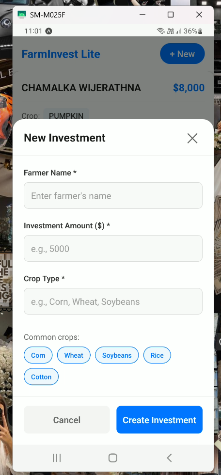
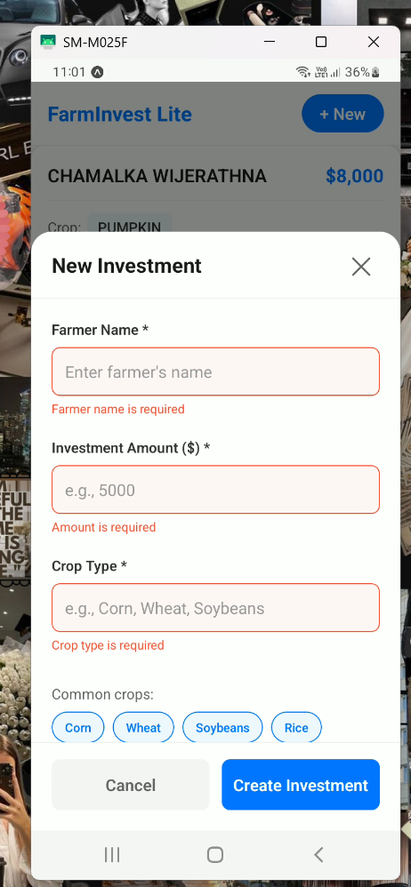

# FarmInvest-Lite-Mobile-App
FarmInvest Lite is a small Expo App (single-screen + detail) that lists investments and  allows creating a new investment locally
# FarmInvest Lite

## 📱 Mobile Investment Tracking App

A full-stack React Native application with Express.js backend and MySQL database for tracking agricultural investments. Built as an assessment for an Associate Mobile Developer position.
## Proof Screen Shots
<div align="center">
  <h3>📱 App Screenshots - Step by Step</h3>
  
  <table>
    <tr>
      <td align="center"><strong>Step 1: Home Screen</strong></td>
      <td align="center"><strong>Step 2: Create Investment</strong></td>
      <td align="center"><strong>Step 3: Success View</strong></td>
    </tr>
    <tr>
      <td></td>
      <td></td>
      <td></td>
    </tr>
    <tr>
      <td>View all investments with pull-to-refresh</td>
      <td>Fill out new investment form with validation</td>
      <td>See optimistic update and successful creation</td>
    </tr>
  </table>
  
  <p><em>App workflow from viewing to creating investments</em></p>
</div> 

*Investment detailed cards and new investment modal*


*Investment listing with detailed cards *


*Investment validation*

## ✨ Features

### Mobile App (Expo + React Native)
- 📊 Investment listing with detailed cards
- ➕ Create new investments with optimistic UI updates
- 🔄 Pull-to-refresh functionality
- ⚡ Real-time validation and error handling
- 📱 Responsive design for mobile devices
- 🎨 Clean, modern UI with proper loading states

### Backend API (Express.js)
- 🚀 RESTful API endpoints
- 🔐 SQL injection prevention with parameterized queries
- ✅ Input validation and error handling
- 📡 CORS enabled for cross-origin requests

### Database (MySQL)
- 🗄️ Structured investment data storage
- 📈 Sample seed data included
- 🔒 Secure database connections

## 🛠️ Tech Stack

**Frontend:**
- React Native (Expo Managed Workflow)
- TypeScript
- Axios for API calls
- React Native Testing Library

**Backend:**
- Node.js with Express.js
- MySQL2 with connection pooling
- Dotenv for environment configuration

**Database:**
- MySQL 8.0+

## 🚀 Getting Started

### Prerequisites
- Node.js (v16 or higher)
- MySQL (v8.0 or higher)
- Git
- Expo Go app (for mobile testing)

### Installation

1. **Clone the repository**
```bash
git clone https://github.com/dimesha/FarmInvest-Lite-Mobile-App.git
cd farminvest-lite
```

2. **Set up the database**
```bash
cd Backend
mysql -u root -p < schema.sql
mysql -u root -p < seed.sql
```

3. **Configure backend**
```bash
# Install dependencies
npm install

# Start the server
npm start
# Server runs on http://localhost:3000
```

4. **Configure mobile app**
```bash
cd Frontend
cd androidApp
npm install
npm start
```
### ⚠️ IMPORTANT: Android Emulator uses different localhost address
Use 10.0.2.2 for Android Studio emulator
EXPO_PUBLIC_BACKEND_URL=http://10.0.2.2:3000


5. **Run the app**
- Install Expo Go on your mobile device
- Scan the QR code from the terminal
- App will load automatically

## 📁 Project Structure

```
farminvest-lite/
├── Frontend/androidApp/                 # Expo React Native app
│   ├── src/
│   │   ├── components/    # Reusable UI components
│   │   ├── services/      # API service layer
│   │   ├── types/         # TypeScript interfaces
│   │   └── utils/         # Utility functions
│   ├── __tests__/        # Unit tests
│   ├── App.tsx           # Main application component
│   └── package.json      # Dependencies
├── backend/              # Express.js API server
│   ├── schema.sql       # Database schema
│   ├── seed.sql         # Sample data
│   ├── server.js        # Main server file
│   └── package.json     # Dependencies
├── .gitignore           # Git ignore rules
└── README.md           # This file
```

## 🔧 Configuration

### Environment Variables

**Backend (.env file)**
```env
PORT=3000
DB_HOST=localhost
DB_USER=root
DB_PASSWORD=
DB_NAME=farminvest
```

**Mobile (.env file)**
```env
EXPO_PUBLIC_BACKEND_URL=http://localhost:3000
# For physical device testing:
# EXPO_PUBLIC_BACKEND_URL=http://YOUR_IP_ADDRESS:3000
```

## 📖 API Documentation

### Endpoints

| Method | Endpoint | Description |
|--------|----------|-------------|
| GET | `/api/investments` | Get all investments |
| POST | `/api/investments` | Create a new investment |

### Example Requests

**GET /api/investments**
```bash
curl http://localhost:3000/api/investments
```

**POST /api/investments**
```bash
curl -X POST http://localhost:3000/api/investments \
  -H "Content-Type: application/json" \
  -d '{"farmer_name":"Samadi","amount":5000,"crop":"Sweet Potato"}'
```

## 🧪 Testing

### Run Unit Tests
```bash
cd Frontend
cd androidApp
npm test
```

Tests cover:
- Component rendering
- Data display formatting
- Prop validation

### Test API Endpoints
```bash
# Test backend connectivity
curl http://localhost:3000/api/investments
```

## 🐛 Troubleshooting

### Common Issues

1. **MySQL Connection Failed**
   - Ensure MySQL service is running
   - Check database credentials in `.env` file

2. **Expo App Can't Connect to Backend**
   - Verify backend is running on port 3000
   - For physical device, use computer's IP address
   - Ensure devices are on same network

3. **Port 3000 Already in Use**
   ```bash
   # Kill process on port 3000
   lsof -ti:3000 | xargs kill -9
   ```

## 📝 Development

### Backend Development
```bash
cd Backend
npm install
npm start          # Start server
npm run dev       # Start with auto-reload
```

### Mobile Development
```bash
cd Frontend
cd androidApp
npm install
npm start         # Start Expo dev server
npm test          # Run tests
```

## 🏗️ Architecture

### Frontend Architecture
- **Component-based design** with separation of concerns
- **Custom hooks** for data fetching and state management
- **TypeScript interfaces** for type safety
- **Optimistic UI updates** for better user experience

### Backend Architecture
- **Middleware pattern** for request processing
- **Connection pooling** for database efficiency
- **Error handling middleware** for consistent error responses
- **Parameterized queries** for security

## 📄 License

This project was created for interview assessment purposes by Dimesha Wijerathna.

**Built with ❤️ for the mobile developer assessment**